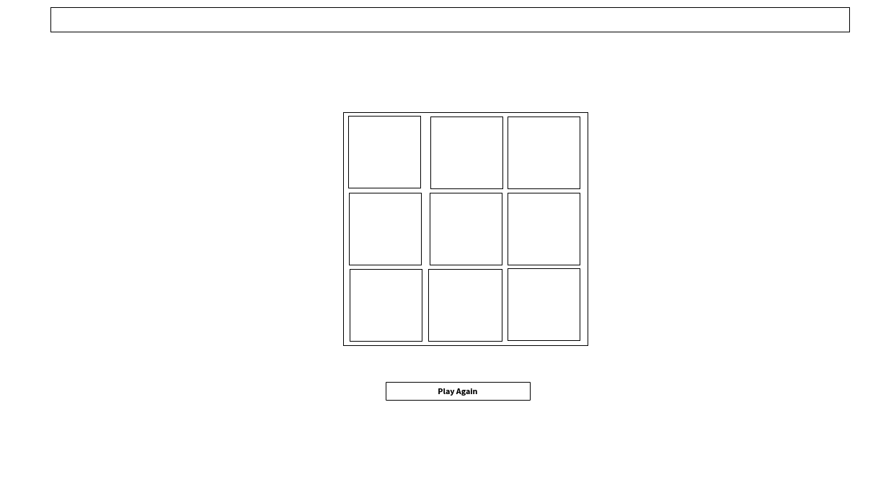

# Tic-Tac-Toe
### List technologies used:
<<<<<<< HEAD
1-Visual Studio Code
2-programming language HTML .
3-programming language CSS .
4-programming language JavaScript .

### Link to wireframes

 ### User Stories:
*  As a user, I should be able to start a new tic tac toe game
* As a user, I should be able to click on a square to add X first and then O, and so on
* As a user, I should be shown a message after each turn for if I win, lose, tie or who's turn it is next
* As a user, I should not be able to click the same square twice
* As a user, I should be shown a message when I win, lose or tie
* As a user, I should not be able to continue playing once I win, lose, or tie
* As a user, I should be able to play the game again without refreshing the page

 ### Document your planning and tell a story about your development process and problem-solving strategy.
List of problems and their solution:
The problem is let Player1 was defined inside function Play ()
Solve it to be outside function.
in addEventListener The problem was that one could be marked above another mark and its changes
solved by{once: true}
The problem with replay()I cleared the previous game but I was unable to start a new game
Solve it by adding addEventListener after an command remove
The problem was that let let moveCount+= 1; function getWinner () help determine Tie.
=======
1. Visual Studio Code
2. programming language HTML .
3. programming language CSS .
4. programming language JavaScript .

### Link to wireframes and user stories.

 User Stories:
 Tic-Tac-Toe game allows two player games.
 Containing board and X and O and  Button"PlayAgain" With a bar showing game status.
 An easy game, the player can put a mark X or O in box he wants in board .
 None of the players can place a mark above the other.
 A player cannot complete the game if one of them wins or the game ends in a negative tie،But he can start playing a new game with Button"PlayAgain".
 There is a bar showing the status of the game،
It will be announced if X plays or player O and winner and tie.

 ### Document your planning and tell a story about your development process and problem-solving strategy.
List of problems and their solution:
* The problem is let Player1 was defined inside function Play ()
Solve it to be outside function.
* in addEventListener The problem was that one could be marked above another mark and its changes
solved by{once: true}
* The problem with replay()I cleared the previous game but I was unable to start a new game
Solve it by adding addEventListener after an command remove
* The problem was that let let moveCount+= 1; function getWinner () help determine Tie.
>>>>>>> dd5e9ac91b33961772ec33f55fdd61c9a4df5ed6
Solved it was moveCount=٠ starting from zero

### List unsolved problems which would be fixed in future iterations.
I dont have site fully responsive so that it is playable from a mobile phone
I hope in the future it will be site fully responsive so that it is playable from a mobile phone

<<<<<<< HEAD
   
### Describe how you solved for the winner
In function getWinner (), it is defined from box1 to box9 and indicated by using the id that is set for each box in the html table،Then it must be on condition that the value of box1 is not equal null and if the value of box1 is equal to the value of box2 and the value of box3 then return the winner by using selectWinnerBoxes،In selectWinnerBoxes we take three values that determine the winner by condition and we print Winner.

### Describe how some of your favorite functions work
function Play () Here the game starts Was defined
  let Player1 = 1;and  turn out function Then a condition was set inside if let Player1 = 1 equals one so type X and turn O else  type O turn X

=======

### Describe how you solved for the winner
In function getWinner (), it is defined from box1 to box9 and indicated by using the id that is set for each box in the html table،Then it must be on condition that the value of box1 is not equal null and if the value of box1 is equal to the value of box2 and the value of box3 then return the winner by using selectWinnerBoxes،In selectWinnerBoxes we take three values that determine the winner by condition and we print Winner.

### Describe how some of your favorite functions work
function Play () Here the game starts Was defined
  let Player1 = 1;and  turn out function Then a condition was set inside if let Player1 = 1 equals one so type X and turn O else  type O turn X
>>>>>>> dd5e9ac91b33961772ec33f55fdd61c9a4df5ed6
